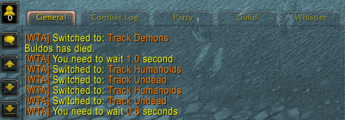

# 🎮 Warmane AddOns Collection

Collection of custom World of Warcraft addons specifically developed for Warmane's WotLK (3.3.5a) servers.

## 📋 Table of Contents
- [Available AddOns](#-available-addons)
  - [WarmaneCommonUtils](#warmanecommonutils)
  - [WarmaneTrackingAid](#warmanetrackingaid)
- [Screenshots](#-screenshots)
- [Installation](#️-installation)
- [Dependencies](#-dependencies)
- [Feedback & Development](#-feedback--development)
- [Contributing](#-contributing)
- [Support](#-support)

## 📦 Available AddOns

### WarmaneCommonUtils
📚 Core library providing shared functionality for all Warmane addons.
- Color-coded message formatting
- Safe API wrappers
- Slash commands helpers

### WarmaneTrackingAid
🎯 Automatically switches Hunter tracking based on target type.
- Smart tracking switching for Hunters
- Triggers only for neutral/hostile targets
- GCD-aware to prevent false switching
- Implemented to work with manual tracking switching as well

## 📸 Screenshots

### WarmaneTrackingAid

*Reactive tracking system adapting to enemy types in PvP combat.*

## ⚙️ Installation

1. Download the latest release
2. Extract the addon folders to your `World of Warcraft 3.3.5a/Interface/AddOns` directory
3. Ensure addon names match exactly (case-sensitive)
4. Restart WoW if it was running

## 🔧 Dependencies

WarmaneCommonUtils is required by all addons, otherwise they are standalone and you don't need to use all of them.

## 💡 Feedback & Development

I'm actively developing custom AddOns for Warmane! Your input is valuable:

- Report any bugs or unexpected behaviour
- Share your ideas for improvements or additional functionality
- Request entirely new addons
- Either open an issue on GitHub or reach out via Discord: **jimmorioriarty**
- Note that I'm currently not interested in backporting existing addons

All feedback is appreciated and helps make these addons better for everyone!

## 🤝 Contributing

Contributions are welcome! Here's how you can help:
1. Fork the repository
2. Create a new branch following the naming convention:
   - Format: `feature/f-wxy-feature-name`
   - `f` indicates it's a feature
   - `wxy` is the addon shortcode (e.g., wta for WarmaneTrackingAid)
   - `feature-name` describes the feature
   - Example: `feature/f-wta-track-hidden`
3. Commit your changes (`git commit -am 'WXY: Added awesome feature'`)
   - Commit messages need to start with the addon shorcode (WXY) to maintain order
4. Push to the branch (`git push origin feature/f-wxy-feature-name`)
5. Open a Pull Request

If you want to add your own Warmane AddOns to this repository:

1. Addon Naming Requirements:
   - Follow the format `Warmane[Addon][Name]` for consistency
   - Exactly three words, first always being "Warmane"

2. Dependencies and Utils:
   - Utilize the WarmaneCommonUtils library for common functionality (API calls, message formatting)
   - You may extend WarmaneCommonUtils with new functionality for your addons while maintaining backward compatibility

3. Code Standards:
   - Follow Lua language conventions
   - Follow WoW addon development best practices
   - Use PascalCase for function names and camelCase for variable names
   - Include appropriate code documentation
   - Document your addon in this README with description and screenshots

## ⭐ Support

If you find these addons helpful, please star the repository and share with other Warmane players!

---
Made with ❤️ for the Warmane Community
