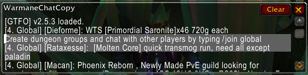

# 🎮 Warmane AddOns Collection

Collection of custom World of Warcraft addons specifically developed for Warmane's WotLK (3.3.5a) servers.

## 📋 Table of Contents
- [Available AddOns](#-available-addons)
  - [WarmaneCommonUtils](#warmanecommonutils)
  - [WarmaneTrackingAid](#warmanetrackingaid)
  - [WarmaneChatCopy](#warmanechatcopy)
  - [WarmaneWGReminder](#warmanewgreminder) [WIP]
  - [WarmaneInstanceTracker](#warmaneinstancetracker) [WIP]
- [Screenshots](#-screenshots)
- [Installation](#️-installation)
- [Dependencies](#-dependencies)
- [Feedback & Development](#-feedback--development)
- [Contributing](#-contributing)
- [Support](#-support)

## 📦 Available AddOns

### WarmaneCommonUtils
📚 Core library providing shared functionality for all Warmane addons.
- Color-coded message formatting
- Safe API wrappers
- Slash commands helpers

### WarmaneTrackingAid
🎯 Automatically switches Hunter tracking based on target type.
- Smart tracking switching for Hunters
- Triggers only for neutral/hostile targets
- GCD-aware to prevent false switching
- Implemented to work with manual tracking switching as well

### WarmaneChatCopy
📋 Makes chat messages easily copyable.
- Click on the channel name or into the message directly to copy messages into a new window
- You can copy messages from the copy window with `CTRL-C`
- Works with all message types (channels, system, say, ...)
- Supports multiple messages in the copy window
- Clear button to reset the copy window content

### WarmaneWGReminder [WIP]
⚠️ The reminder time has offset and the fix is not yet implemented.

⏰ Reminds players about upcoming Wintergrasp battle.
- Accurate Wintergrasp battle reminder
- Shows notifications at 30, 15, and 5 minutes before battle
   - Those values can be changed in `WarmaneWGReminder.lua`, line 13
- Also shows notification right after the battle begins and ends
- Check is performed each second

### WarmaneInstanceTracker [WIP]
⚠️ This addon has many known bugs and is not working properly. Don't use it unless you are programmer and want to fix the bugs.

- This addon is heavily inspired by [Nova Instance Tracker](https://www.curseforge.com/wow/addons/nova-instance-tracker).
- The goal is to track player's dungeon times, mob kills, XP gains and more.
- Once the main goal is achieved, there is also huge room for expanding functionality both in breadth (i.e. adding raids) and in depth (i.e. more statistics).

## 📸 Screenshots

### WarmaneTrackingAid

*Reactive tracking system adapting to enemy types in PvP combat.*

### WarmaneChatCopy

*Separate window to copy any message from the chat, created by clicking on the channel name or into the message directly.*

### WarmaneWGReminder

*Timely reminder for Wintergrasp battles to ensure you never miss one again.*

## ⚙️ Installation

1. Download the latest release
2. Extract the addon folders to your `World of Warcraft 3.3.5a/Interface/AddOns` directory
3. Ensure addon names match exactly (case-sensitive)
4. Restart WoW if it was running

## 🔧 Dependencies

WarmaneCommonUtils is required by all addons, otherwise they are standalone and you don't need to use all of them.

## 💡 Feedback & Development

- I'm currently <b>not</b> working on this project and I <b>won't</b> do any code changes. The WIP addons will stay WIP. 
- That being said, I'm not abandoning this for good and might return to it in the future if I start playing WoW again.
- As of now I will only merge your PR or add you as a collaborant if you'd like to contribute to this project.
   - Note that I will only review the PR's with Copilot or directly merge them if the changes are small.
- Otherwise feel free to do whatever with this repo, you can link it if you use it in your project, but I don't demand it.

## 🤝 Contributing

- As stated in section above, contributors are welcome. 
- Some general rules for any PR, as we don't want any spaghetti code:
   - Follow Lua language conventions and WoW addon development best practices
   - Use PascalCase for function names and camelCase for variable names
   - Comment your code
   - Update this file so the description and screenshot correspond to the latest AddOn version
- Additional rules for for <b>completely new</b> AddOns for this repo:

1. Addon Naming Requirements:
   - Follow the format `Warmane[Addon][Name]` for consistency
   - Exactly three words, first always being "Warmane"

2. Dependencies and Utils:
   - Utilize the WarmaneCommonUtils library for common functionality (API calls, message formatting)
   - You may extend WarmaneCommonUtils with new functionality for your addons while maintaining backward compatibility

- Otherwise, there are no rules for branch names etc., just make it that the commit messages make sense.

---
Made with ❤️ for the Warmane community