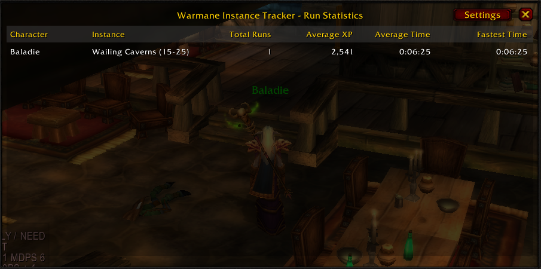
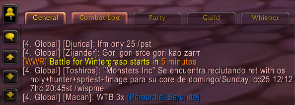
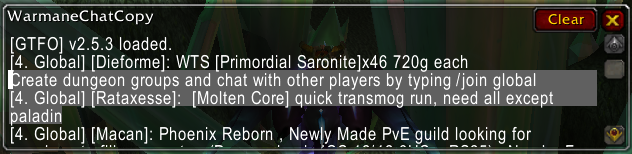
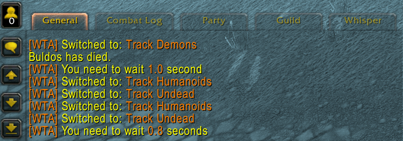
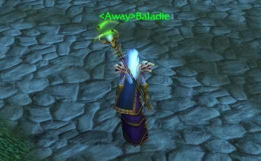

# Warmane AddOns Collection


Collection of custom World of Warcraft AddOns specifically developed for Warmane's WotLK (3.3.5a) servers.

A big thanks goes to the owner of [`3.3.5-interface-files`](https://github.com/wowgaming/3.3.5-interface-files) GitHub repository, which I'm using a lot during the development.

First-party AddOns expose in-game settings under `Interface -> AddOns -> Warmane AddOns`.

## 📋 Table of Contents

- [Available AddOns](#-available-addons)
  - [WarmaneInstanceTracker](#warmaneinstancetracker)
  - [WarmaneWGReminder](#warmanewgreminder)
  - [WarmaneChatCopy](#warmanechatcopy)
  - [WarmaneTrackingAid](#warmanetrackingaid)
  - [WarmaneHealerMana](#warmanehealermana)
  - [WarmaneHealerProtection](#warmanehealerprotection)
  - [WarmaneNotAway](#warmanenotaway)
- [Backported AddOns](#-backported-addons)
  - [MBB](#mbb-minimapbuttonbag)
- [Screenshots](#-screenshots)
  - [WarmaneInstanceTracker](#warmaneinstancetracker-1)
  - [WarmaneWGReminder](#warmanewgreminder-1)
  - [WarmaneChatCopy](#warmanechatcopy-1)
  - [WarmaneTrackingAid](#warmanetrackingaid-1)
  - [WarmaneNotAway](#warmanenotaway-1)
- [Installation](#️-installation)
- [Feedback](#-feedback)
- [Contributing](#-contributing)
  - [Development Sync](#️-development-sync)

## 📦 Available AddOns

### WarmaneInstanceTracker

📋 Tracks completed dungeon runs and stores both run history and aggregated per-character/per-instance stats.

- Main table UI (`/wit`) now shows:
  - `Character`
  - `Instance`
  - `Total Runs`
  - `Average Time`
  - `Fastest Time`
  - `Levels Per Minute`
  - `Levels Per Run`
- Character rows include the latest known level in the table, for example `Baladie (42)`
  - WIT updates the saved character level when you level up and when you enter the world on that character
  - Existing old rows can still be backfilled with `/wit update` while logged into that character
- Instance names in the table include level ranges where available, for example `Wailing Caverns (15 - 25)`
- WIT normalizes known alternate dungeon names reported by the client/Warmane, including hub-and-wing names such as `Auchindoun: Sethekk Halls`.
- Max-level and other no-XP runs are handled safely:
  - Such runs still increase run counts and time statistics
  - Level-based columns show `-` when no precise level-progress data exists for that character+instance row
  - Level averages are calculated only from XP-bearing runs, so level 80 clears do not drag leveling stats down to zero
- Table quality-of-life features:
  - Live text search filters rows as you type
  - Character dropdown filter supports `All` plus multi-select toggles with instant checkmark updates
  - Clicking a column header sorts ascending/descending by that column
  - Column widths are configurable in `addons/WarmaneInstanceTracker/vars/Constants.lua`
- Table actions:
  - `Settings` opens `Interface -> AddOns -> Warmane AddOns -> Instance Tracker`
  - `Export` opens an in-game CSV export dialog with copyable text
  - Export is intentionally in-client only: WoW 3.3.5a addons cannot write files to arbitrary paths like `C:\wit-export`
- Slash commands:
  - `/wit` opens or closes the stats table
  - `/wit on` and `/wit off` enable/disable instance tracking without reloading the UI
  - `/wit config` opens `Interface -> AddOns -> Warmane AddOns -> Instance Tracker`
  - `/wit update` updates saved table rows with the current logged-in character's level
    - This does **not** update offline alts; WoW only exposes the current character's live level
- Interface Options panel (`Interface -> AddOns -> Warmane AddOns -> Instance Tracker`) includes:
  - Run statistics buttons: open table, export CSV
  - Current run controls: status, start/end, pause/continue, reset, and live elapsed time
  - User settings: instance tracker, party completion message
  - Table settings: character scope, level-range filter, table size
  - Developer settings: debug printing, debug logging
- Debug commands (`/wit debug ...`) include `on|off`, `state`, `target`, `simulate "Instance Name" duration xp`, and `log on|off|status|clear`.
- On completion, can post one summary line to party chat:
  - `[WIT] <instance> completed in <time>. Levels per minute: <value>. Levels per run: <value>.`
- SavedVariables are split for clarity:
  - `InstancesData` (runs + aggregated stats)
  - `SettingsData` (user/developer toggles)
  - `DebugData` (debug death log)
  - New runs save per-run `levelsGained` plus a `levels` table of level-to-next-level XP values, for example `[30] = 38880`
  - Aggregated stats use a dedicated schema migration path so historical runs can be rebuilt after stat structure updates

### WarmaneWGReminder

⏰ Reminds you about upcoming Wintergrasp battle.

- Uses the in-game `GetWintergraspWaitTime()` API for accurate battle timing
- Shows notifications at 30, 15, and 5 minutes before battle
- Also shows notification right after the battle begins and ends
- Slash commands `/wwr` and `/wwr when` check time until next battle
- Slash commands `/wwr on` and `/wwr off` enable/disable automatic reminders without reloading the UI
- Interface Options panel: `Warmane AddOns -> WG Reminder`
- Type `/wwr help` for a list of available commands

> ℹ️ This AddOn is only activates if logged in as a level 80.

### WarmaneChatCopy

📄 Makes chat messages copyable on mouse click.

- Click on a channel name to copy the message into a new window
  - For messages without a channel, click into the message directly instead
- You can copy messages from the copy window with `CTRL-C`
- Works with all message types (channels, system, say, ...)
- Does not intervene with item or quest links, usernames, etc.
- Copying more messages makes them appear under eachother in the click order
- Clear button to reset the copy window content
- Slash commands `/wcc on` and `/wcc off` enable/disable copying persistently without reloading the UI
- Slash command `/wcc` shows help
- Interface Options panel: `Warmane AddOns -> Chat Copy`
- Type `/wcc help` for a list of available commands

### WarmaneTrackingAid

🎯 Automatically switches Hunter tracking based on target type.

- Smart tracking switching for Hunters
- Triggers only for neutral/hostile targets
- GCD-aware to prevent false switching
- Implemented to work with manual tracking switching as well
- Slash commands `/wta on` and `/wta off` enable/disable tracking switching without reloading the UI
- Interface Options panel: `Warmane AddOns -> Tracking Aid`
- Type `/wta help` for a list of available commands

> ℹ️ This AddOn only activates if logged in as a Hunter.

### WarmaneHealerMana

💬 Warns your dungeon or raid group when you are low on mana as the assigned healer.

- Active in party/raid instances for selected group sizes; 5, 10, and 25-player groups are enabled by default
- Uses Blizzard's assigned healer role when available, with a healer talent/class fallback for manual portal groups
- Sends `Healer Mana: I'm out of mana!` to group chat with a configurable 60-second default cooldown
- Enabling the AddOn mid-fight starts a full warning delay before the first low-mana shout
- Slash commands `/whm on` and `/whm off` enable/disable healer mana warnings without reloading the UI
- Slash command `/whm party <2|3|5|10|25> <on|off>` enables/disables auto-activation for a group size
- Slash command `/whm delay <seconds>` changes the saved warning delay between 30 and 180 seconds
- Slash command `/whm threshold <5|10|15|20|25>` changes the saved mana threshold in 5% steps
- Interface Options panel: `Warmane AddOns -> Healer Mana` with enabled, delay, mana threshold, and group-size auto-activate controls

### WarmaneHealerProtection

💬 Warns your dungeon or raid group when you have aggro as the assigned healer.

- Active in party/raid instances for selected group sizes; 5, 10, and 25-player groups are enabled by default
- Uses Blizzard's assigned healer role when available, with a healer talent/class fallback for manual portal groups
- Sends `Healer Protection: I have aggro!` to group chat with a configurable 15-second default cooldown
- Enabling the AddOn mid-fight starts a full warning delay before the first aggro shout
- Slash commands `/whp on` and `/whp off` enable/disable healer protection warnings without reloading the UI
- Slash command `/whp party <2|3|5|10|25> <on|off>` enables/disables auto-activation for a group size
- Slash command `/whp` shows help and `/whp delay <seconds>` changes the saved warning delay between 5 and 120 seconds
- Interface Options panel: `Warmane AddOns -> Healer Protection` with enabled, delay, and group-size auto-activate controls
- Checks visible hostile targets and recent direct combat-log hits to detect mobs attacking you, without treating boss spell casts alone as aggro

### WarmaneNotAway

🟢 Automatically clears your `<Away>` status when you become active.

- This _should be_ WoW's default behvaior, but I've been having problems with it on Warmane
- Uses Blizzard's built-in `autoClearAFK` option to keep behavior safe and lightweight
- Re-enables AFK auto-clear when the AddOn loads and when entering the world
- Slash commands `/wna on` and `/wna off` enable/disable AFK auto-clear without reloading the UI
- Interface Options panel: `Warmane AddOns -> Not Away`
- Type `/wna help` for a list of available commands
- No key listener, no polling loop, and no manual `/afk` simulation

## 🧩 Backported AddOns

### MBB (MinimapButtonBag)

🧳 Backported third-party minimap button bag for Warmane's WotLK 3.3.5a client.

- Lives separately from first-party AddOns in `backports/MBB`
- Collects minimap buttons into a single pop-out menu
- Persists the MBB button position per character across `/reload` and addon syncs
- Keeps the original AddOn identity while applying compatibility and bug fixes for this repository
- Includes English UI text only

## 📸 Screenshots

### WarmaneInstanceTracker



_A filterable, sortable in-game table tracking your dungeon runs with leveling context, level/time averages, and copyable CSV export._

### WarmaneWGReminder



_Timely reminder for Wintergrasp battles to ensure you never miss one again._

### WarmaneChatCopy



_Separate window to copy any message from the chat, created by clicking on the channel name or into the message directly._

### WarmaneTrackingAid



_Reactive tracking system adapting to enemy types in PvP combat._

### WarmaneNotAway



_No more getting stuck with `<Away>` above your name after you are already back in action._

## ⚙️ Installation

1. Download the latest release
2. Extract the AddOn folders from the `addons/` directory to your `World of Warcraft 3.3.5a/Interface/AddOns` directory
3. Ensure AddOn names match exactly (case-sensitive)
4. Restart WoW if it was running

All AddOns are standalone, install only the ones you want to use.

## 💡 Feedback

This project is being under active develompent as of April 2026.

- If you encounter a bug or have a feature request for existing AddOn, open a GitHub issue
- If you have an AddOn idea, you can email me on `info@matejkadlec.cz`
  - If I'll find it interesting, there's a good chance I will create it for you for a voluntary donation
  - If I don't find it interesting, I can still do it for a fixed price (I can provide an invoice)
- Feel free to you use any of my AddOns in your project, in that case a link back to this repository is appreciated

## 🤝 Contributing

- Contributors are welcome, just create a PR and assign it to me for a review
- Some general rules for all PRs, as we don't want any spaghetti code:
  - Follow Lua language conventions and WoW AddOn development best practices
    - If you code in VSCode, I highly recommend [WoW Bundle](https://marketplace.visualstudio.com/items?itemName=Septh.wow-bundle) extension
  - Use PascalCase for function names and camelCase for variable names
  - Comment your code
  - Update this file so the description and screenshot correspond to the latest AddOn version
- Additional rules for for **completely new** AddOns for this repository:
  1. Follow the naming format `Warmane[AddOn][Name]` for consistency
  2. Each AddOn must be fully standalone with no cross-AddOn dependencies
  3. Required `.toc` file attributes:
     ```ini
     ## X-Collaboration: Matej Kadlec (https://github.com/matejkadlec)
     ## X-Repository: https://github.com/matejkadlec/warmane-addons
     ```

- Otherwise, there are no rules for branch names etc., just make it that the commit messages make sense

### 🔄️ Development Sync

If you are developing the AddOns, you can sync the whole `addons/` directory into your WoW client with the helper script:

1. Copy `.env.sync-addons.example` to `.env.sync-addons`
2. Set `SYNC_ADDONS_DEST_DIR` to the absolute path of your `Interface/AddOns` folder
3. Decide whether `SYNC_ADDONS_AUTO_INSTALL_RSYNC` should be `true` or `false`
   - Set it to `true` if you want the script to try installing `rsync` automatically with `apt-get`
   - Set it to `false` if you prefer the script to skip installation attempts and use `cp` fallback when needed
4. Run `./scripts/sync-addons.sh`

Optional variables:

- `SYNC_ADDONS_SOURCE_DIR` if your source `addons/` directory lives somewhere else
- `SYNC_ADDONS_RSYNC_BIN` if you want to point to a specific `rsync` binary

The real `.env.sync-addons` file is ignored by Git, while `.env.sync-addons.example` stays in the repository as the shared template.

---

Made with ❤️ for the Warmane community
